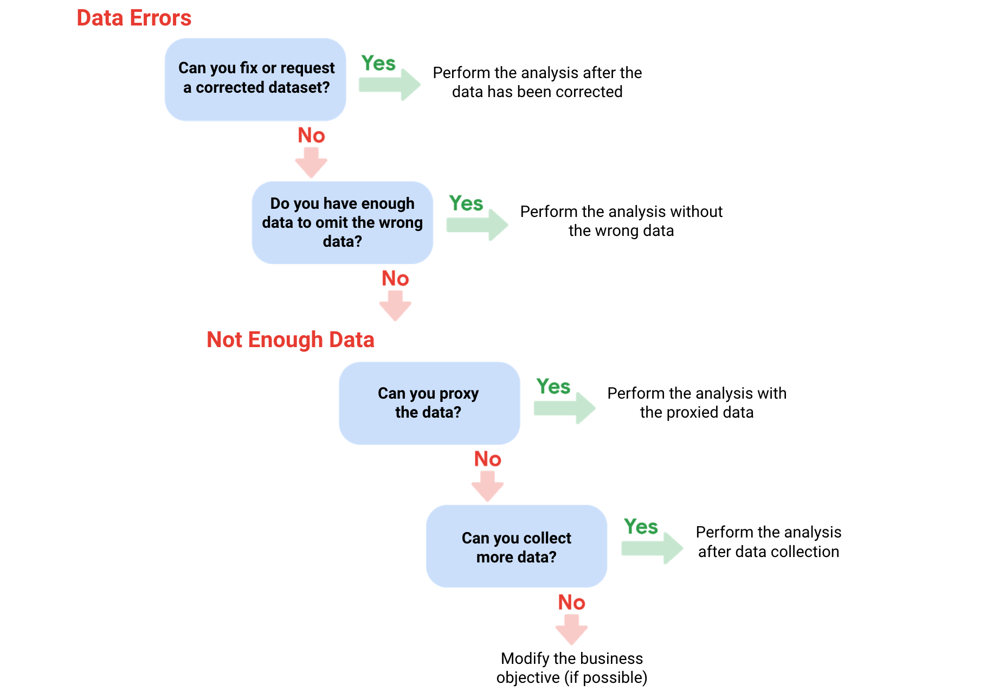

# Problematic Data

## 1. Recognizing Data Limitations and Their Impact

### Common Scenarios:

- Insufficient historical data: e.g., predicting seasonal trends with only one year of data.
- Data limited to a single source: leads to incomplete insights, e.g., only one booking site in the tourism industry.
- Incomplete incoming data: e.g., analyzing trends for a new attraction with limited data.
- Outdated data: irrelevant for current trends, e.g., old customer satisfaction scores.
- Geographically limited data: not representative for global insights.

### Steps to Handle Data Limitations:

- Pause and consult stakeholders to adjust the business objective or scope.
- Wait for more data if time permits.
- Look for alternate datasets.
- Use trends or partial insights and communicate the limitations.

## 2. Data Issues and Solutions

### No Data:

**Solution**:

- Collect data on a small scale for preliminary analysis and request more time to gather comprehensive data.
- Use proxy data (similar datasets from comparable demographics or regions).

### Too Little Data:

**Solution**:

- Combine proxy data with available data, e.g., merge trends of golden retriever owners with labrador owners.
- Modify the analysis scope and clearly state limitations in conclusions.

### Wrong Data or Data with Errors:

**Solution**:

- Re-clarify requirements to ensure correct data collection.
- Correct errors if possible (e.g., fix faulty conditional formulas in spreadsheets).
- If corrections are not feasible:
  - Ignore problematic data if the sample size is still adequate and won't bias results.
  - Communicate clearly about omitted data and its potential impact.

**Key Insight**: Data errors can sometimes signal unreliability; exercise judgment when using such data.

## 3. Decision Tree for Dealing with Data Issues

## 4. Practical Example

- Forecasting Support Center Staffing:
  - Business Objective: Predict monthly support tickets to determine hiring needs.
  - Solution: Use historical data spanning multiple years to identify seasonal trends.
  - Insight: Insufficient data (e.g., one year) would miss recurring patterns like post-holiday refund spikes in January.

## 5. When to Adjust Scope or Objectives

- Consult stakeholders when data isn't enough or doesn’t align with objectives:
- Adjust analysis frequency (e.g., week-to-week trends instead of monthly).
- Base conclusions on available short-term data and state predictions explicitly.

## 6. Takeaways

- Alignment Matters: Ensure data fits business objectives and addresses key questions.
- Communicate Limitations: Always document gaps, constraints, and potential impacts on conclusions
- Adaptability: Flexible objectives and creative solutions (proxy data, alternate analyses) are crucial to overcome data challenges.
- These strategies ensure effective analysis despite data-related hurdles.
